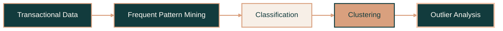

<div id="top"></div>

<br>

<!-- Header Badges -->

<p align="center">
  <a href="https://github.com/soph-k">
    
  </a>
  <a href="https://www.python.org/">
    
  </a>
  <a href="https://jupyter.org/">
    
  </a>
  <a href="https://github.com/soph-k/frequent-pattern-analysis">
    
  </a>
  <a href="https://github.com/soph-k/frequent-pattern-analysis">
    
  </a>
</p>

<br>

<!-- Header -->

<div align="center">

<a href="https://github.com/soph-k">
  
</a>

<h2>『 Frequent Pattern & Data Mining Analysis 』</h2>

<p>
  A four-part exploration of frequent-pattern mining, classification,
  clustering, and outlier analysis using Python and Jupyter Notebook.
</p>

<p>────── ♡ ──────</p>

<p>
  <a href="https://github.com/soph-k/frequent-pattern-analysis">
    <strong>View Repository »</strong>
  </a>
</p>

</div>

<br>

<!-- Table of Contents -->

## ❐ Table of Contents

<details>
<summary><strong>Quick Links</strong></summary>

<ol>
  <li><a href="#about-the-project">About the Project</a></li>
  <li><a href="#project-modules">Project Modules</a></li>
  <li><a href="#learning-path">Learning Path</a></li>
  <li><a href="#key-implementations">Key Implementations</a></li>
  <li><a href="#built-with">Built With</a></li>
  <li><a href="#repository-structure">Repository Structure</a></li>
  <li><a href="#getting-started">Getting Started</a></li>
  <li><a href="#notes">Notes</a></li>
</ol>

</details>

<br>

<!-- About -->

<div id="about-the-project"></div>

## ❐ About the Project

This repository contains a series of data-mining exercises focused on understanding
how different algorithms discover structure, relationships, and unusual behavior
within data.

The project progresses through four major areas:

- Discovering frequent itemsets in transactional data
- Building core components of classification algorithms
- Assigning observations to clusters and updating cluster parameters
- Understanding global, contextual, and collective outliers

Rather than relying on prebuilt machine-learning estimators, the notebooks implement
the main calculations directly in Python. Each notebook also includes sample datasets,
expected outputs, and visible test cells for validating the implementations.

> **Project focus:** understanding how data-mining algorithms work internally without library use.

<p align="right">(<a href="#top">back to top</a>)</p>

<br>

<!-- Project Modules -->

<div id="project-modules"></div>

## ❐ Project Modules

| Week | Topic | Main Implementations | Open |
|---|---|---|---|
| **Week 1** | Frequent Pattern Mining | Apriori, item support, transaction ordering, FP-tree construction | [Notebook »](https://github.com/soph-k/frequent-pattern-analysis/blob/main/week-1/frequent-pattern.ipynb) |
| **Week 2** | Classification | Entropy, information gain, best-attribute selection, Naive Bayes probabilities | [Notebook »](https://github.com/soph-k/frequent-pattern-analysis/blob/main/week-2/classification.ipynb) |
| **Week 3** | Clustering | K-means cluster assignment, centroid updates, EM parameter updates | [Notebook »](https://github.com/soph-k/frequent-pattern-analysis/blob/main/week-3/clustering.ipynb) |
| **Week 4** | Outlier Analysis | Global, contextual, and collective outlier concepts | [Write-up »](https://github.com/soph-k/frequent-pattern-analysis/blob/main/week-4/outlier.md) |

<p align="center">
  <a href="https://colab.research.google.com/github/soph-k/frequent-pattern-analysis/blob/main/week-1/frequent-pattern.ipynb">
    <strong>Week 1 in Colab</strong>
  </a>
  &nbsp; • &nbsp;
  <a href="https://colab.research.google.com/github/soph-k/frequent-pattern-analysis/blob/main/week-2/classification.ipynb">
    <strong>Week 2 in Colab</strong>
  </a>
  &nbsp; • &nbsp;
  <a href="https://colab.research.google.com/github/soph-k/frequent-pattern-analysis/blob/main/week-3/clustering.ipynb">
    <strong>Week 3 in Colab</strong>
  </a>
</p>

<p align="right">(<a href="#top">back to top</a>)</p>

<br>

<!-- Learning Path -->

<div id="learning-path"></div>

## ❐ Learning Path



<p align="center">
  <code>Pattern Discovery</code>
  &nbsp; • &nbsp;
  <code>Prediction</code>
  &nbsp; • &nbsp;
  <code>Segmentation</code>
  &nbsp; • &nbsp;
  <code>Anomaly Reasoning</code>
</p>

<p align="right">(<a href="#top">back to top</a>)</p>

<br>

<!-- Key Implementations -->

<div id="key-implementations"></div>

## ❐ Key Implementations

### 1. Apriori Frequent-Itemset Generation

The first notebook generates frequent itemsets by:

- Counting individual item occurrences
- Applying a minimum-support threshold
- Producing candidate item combinations
- Counting candidate support across transactions
- Pruning itemsets that do not meet the threshold

### 2. FP-Growth Preparation and Tree Construction

The FP-Growth portion includes:

- Calculating item-support counts
- Sorting items by frequency
- Reordering transactions
- Removing unsupported items
- Constructing an FP-tree with counts and child nodes

### 3. Decision-Tree Calculations

The classification notebook implements the main calculations used to select a
decision-tree split:

- Target entropy
- Attribute-level entropy
- Information gain
- Comparison of candidate attributes
- Selection of the highest-information-gain attribute

The sample dataset uses `Loan` as the target variable and includes:

`Age` • `Income` • `Student` • `Credit Rating`

### 4. Naive Bayes Probabilities

The Naive Bayes section calculates:

- Target-class prior probabilities
- Conditional probabilities for each attribute value
- Separate probabilities for positive and negative loan outcomes
- Structured probability dictionaries for later classification

### 5. K-Means Clustering

The K-means implementation performs:

- Euclidean-distance calculations
- Assignment of points to the nearest centroid
- Separation of observations into three clusters
- Recalculation of cluster centroids
- Tracking cluster assignments across two iterations

### 6. Expectation-Maximization Clustering

The EM implementation uses Gaussian distributions to:

- Calculate the probability of each point belonging to each cluster
- Normalize cluster-membership probabilities
- Compute weighted means
- Compute weighted standard deviations
- Return updated cluster parameters after an EM iteration

### 7. Outlier Analysis

The final section reviews three major categories of outliers:

- **Global outliers:** individual observations that differ strongly from the full dataset
- **Contextual outliers:** observations that are unusual only under a particular context
- **Collective outliers:** groups of observations that form an unusual pattern together

<p align="right">(<a href="#top">back to top</a>)</p>

<br>

<!-- Built With -->

<div id="built-with"></div>

## ❐ Built With

<p align="center">
  
  
  
  
</p>

<p align="center">
  
  
  
</p>

<p align="center">
  <sub>Algorithm implementation • Data mining • Classification • Clustering • Pattern discovery</sub>
</p>

<p align="right">(<a href="#top">back to top</a>)</p>

<br>

<!-- Repository Structure -->

<div id="repository-structure"></div>

## ❐ Repository Structure

```text
frequent-pattern-analysis/
├── week-1/
│   ├── data/
│   │   ├── dataset.pickle
│   │   └── test_dataset.pickle
│   └── frequent-pattern.ipynb
│
├── week-2/
│   ├── data/
│   │   ├── dataset.csv
│   │   └── test_dataset.csv
│   └── classification.ipynb
│
├── week-3/
│   ├── data/
│   │   ├── dataset.pickle
│   │   ├── sample_centroids_em.pickle
│   │   ├── sample_centroids_kmeans.pickle
│   │   ├── sample_dataset_em.pickle
│   │   ├── sample_dataset_kmeans.pickle
│   │   ├── sample_result_em.pickle
│   │   ├── sample_result_kmeans.pickle
│   │   └── test_dataset.pickle
│   └── clustering.ipynb
│
├── week-4/
│   └── outlier.md
│
└── README.md
```

<p align="right">(<a href="#top">back to top</a>)</p>

<br>

<!-- Getting Started -->

<div id="getting-started"></div>

## ▹ Getting Started

### ❐ Prerequisites

Make sure you have:

- Python 3
- Git
- Jupyter Notebook or JupyterLab

### ❐ Installation

Clone the repository:

```sh
git clone https://github.com/soph-k/frequent-pattern-analysis.git
cd frequent-pattern-analysis
```

Create a virtual environment:

```sh
python -m venv .venv
```

Activate it on Windows:

```powershell
.venv\Scripts\Activate.ps1
```

Activate it on macOS or Linux:

```sh
source .venv/bin/activate
```

Install the required packages:

```sh
pip install pandas numpy jupyter
```

Start Jupyter Notebook:

```sh
jupyter notebook
```

Open one of the following files:

```text
week-1/frequent-pattern.ipynb
week-2/classification.ipynb
week-3/clustering.ipynb
```

Keep each notebook inside its original weekly directory so its relative data paths
continue to work correctly.

<p align="right">(<a href="#top">back to top</a>)</p>

<br>

<!-- Notes -->

<div id="notes"></div>

## ❐ Notes

- The notebooks use relative paths to access their corresponding `data` directories.
- Sample and test datasets are included with the relevant weekly exercises.
- Visible test cells compare calculated results with expected outputs.
- The implementations are educational and emphasize algorithm mechanics and intermediate calculations.
- Week 4 is a written conceptual analysis rather than an executable notebook.

<p align="right">(<a href="#top">back to top</a>)</p>

<br>

<!-- Footer -->

<div align="center">

<p>────── ♡ ──────</p>

<sub>✦ Discover patterns • Understand algorithms • Learn from data ✦</sub>

</div>

<p align="right">(<a href="#top">back to top</a>)</p>
